# Apex Adventures

## Overview
Apex Adventures is the gateway to the Ultimate Shark Cage Diving Experience! This website was created to deliver an engaging platform for adventure seekers, marine enthusiasts, and anyone captivated by the wonders of the ocean. Apex Adventures aims to redefine the shark diving experience by providing a simple online hub for enthusiasts to explore, book, and embark on exhilarating underwater encounters with Great White Sharks.

The platform was designed to target adrenaline enthusiasts and those seeking unique experiences. Our user-friendly interface ensures easy navigation, allowing users to submit requests to see upcoming trips, learn about our team of expert guides, see some pictures taken by past customers, read their reviews and discover more about Apex Adventures.

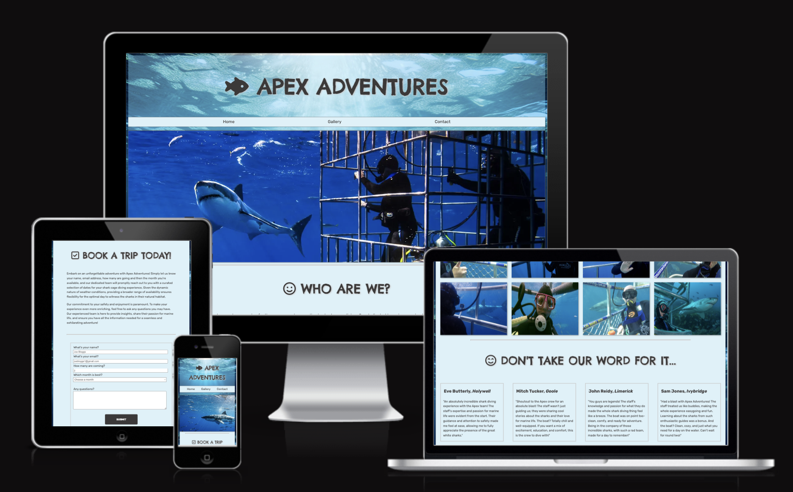

# Table of contents
- [User Experience (UX)](#ux)
    - [External User’s Goal](#external-users-goal)
    - [Site Owner's Goal](#site-owners-goal)
    - [Structure](#structure)
    - [Surface](#surface)
- [Features](#features)
- [Features Left to Implement](#features-left-to-implement)
- [Technologies Used](#technologies-used)
- [Testing](#testing)
    - [Validator Testing](#validator-testing)
    - [Performance](#performance)
    - [Bugs](#bugs)

# User Experience (UX)

## External User’s Goal
The site's users are adventure enthusiasts and shark enthusiasts interested in information and resources related to great white shark cage diving experiences, including locations, images/testimonials and educational content.

## Site Owner's Goal
The goal of the site is to establish an immersive and dependable platform with educational content and testimonials from previous customers. This platform aims to provide users with information about great white shark cage diving and how to book a tour.

## Structure
In the initial stages of crafting the Apex Adventures website, I employed the versatile program <b>Balsamiq Wireframes</b> to create comprehensive wireframes for both desktop and mobile versions. Balsamiq's user-friendly interface and intuitive features facilitated the visualization of the website's layout, ensuring a clear representation of the placement and functionality of each element. This invaluable tool enabled me to map out the user journey, test different design concepts, and refine the overall user experience before diving into the full-scale development. The use of Balsamiq played a pivotal role in streamlining the design process, ensuring a cohesive and user-centric website that seamlessly translates across both desktop and mobile platforms.

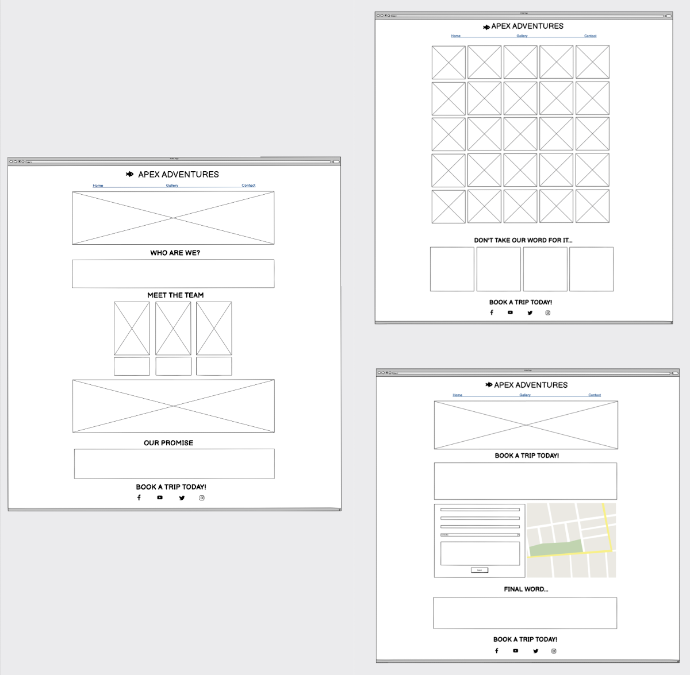
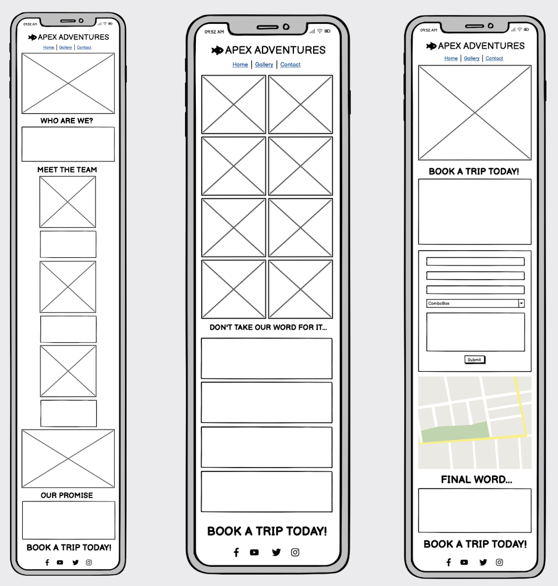

## Surface

### Colours
Main colours:
* background color: rgb(134, 223, 255, 0.4);
* font color: #6217ee#3c3939;
* text-shadow: #c6c4c4;
* border-top: #c6c4c4;

### Fonts 
Main fonts:
* font-family: 'Rubik', sans-serif;
* font-family: 'Chelsea Market', sans-serif;

## Features

### Apex Adventures Logo:
The clickable Apex Adventures logo serves as a convenient route back to the home page, ensuring users have quick access to the central hub of information. This feature enhances user navigation, providing a seamless and user-friendly experience for those exploring our shark cage diving offerings.

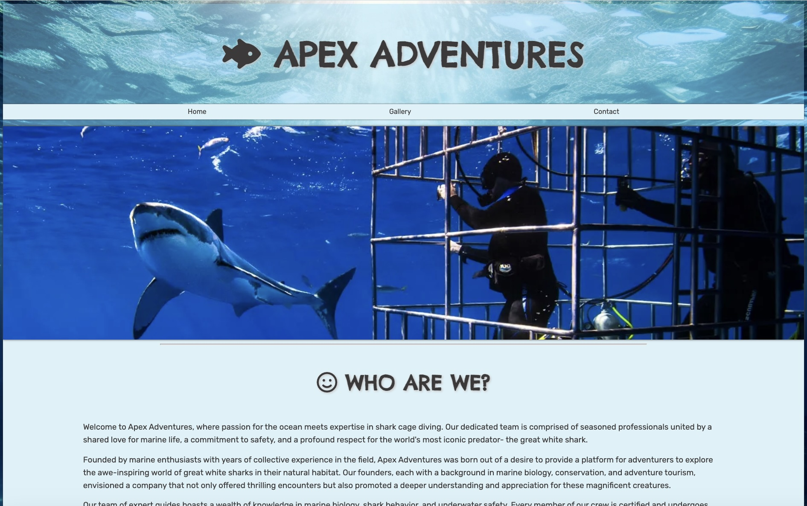

### Navigation Bar:
Our full responsive navigation bar is a key feature present on all three pages – Home, Gallery, and Contact. With identical layouts across pages, users can effortlessly navigate between them on any device, eliminating the need to revert to the 'back' button. This streamlined design enhances user experience, allowing them to easily find the information they seek about our shark cage diving adventures.

### Who Are We Section:
The 'Who Are We' section offers customers insights into the essence of Apex Adventures, sharing a glimpse of our company's background and values. This feature serves as a bridge to connect with potential adventurers, instilling trust and familiarity with our brand.

### Meet the Team Section:
Introducing our core crew, the 'Meet the Team' section provides a personal touch to the Apex Adventures experience. By familiarising users with the individuals behind the scenes, we aim to build a connection and showcase the expertise and passion that fuels our shark cage diving expeditions.

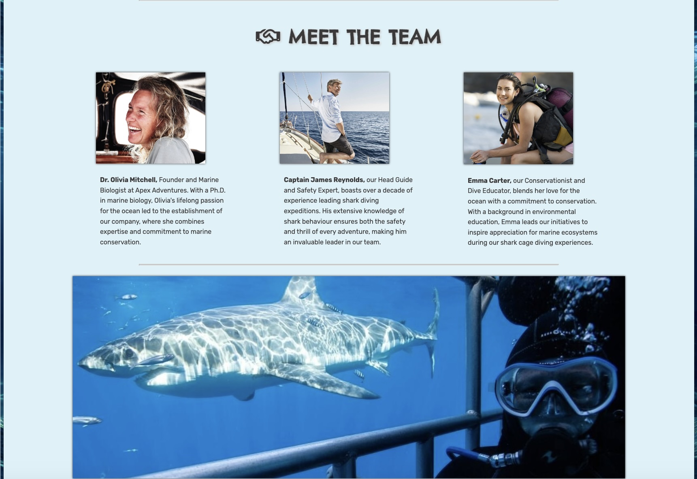

### Gallery Page with Customer Reviews:
The responsive design of our Gallery page provides an engaging visual experience of previous customers in the water with te sharks. Customer reviews following the gallery enhance credibility and build trust, assuring potential adventurers of the exciting and safe experiences others have had with Apex Adventures.

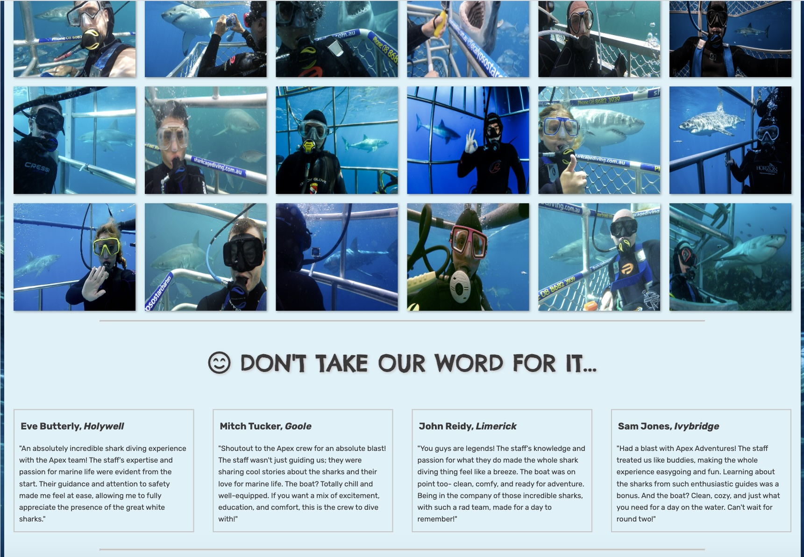

### Our Promise Section:
The 'Our Promise' section encapsulates our commitment to customer care, safety, and the transformative shark cage diving experience. This quote from our team reinforces the values that define Apex Adventures, assuring users of our dedication to their satisfaction and safety.

### Call to Action:
Strategically placed at the bottom of the Home and Gallery pages, the consistent call to action serves as a shortcut redirecting users to the booking page. This user-friendly feature ensures a seamless transition for those ready to embark on their shark cage diving adventure.

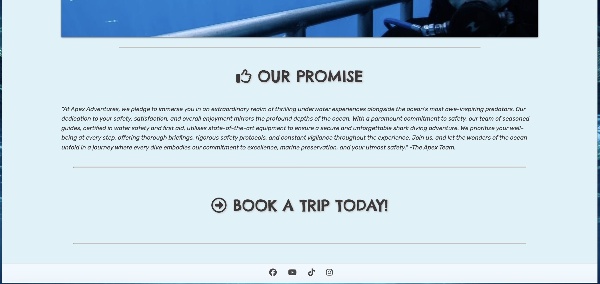

### Footer:
Our footer, present on each page, includes links to our social media platforms. This feature facilitates social engagement and interaction, keeping our audience connected with the latest updates and offerings from Apex Adventures.

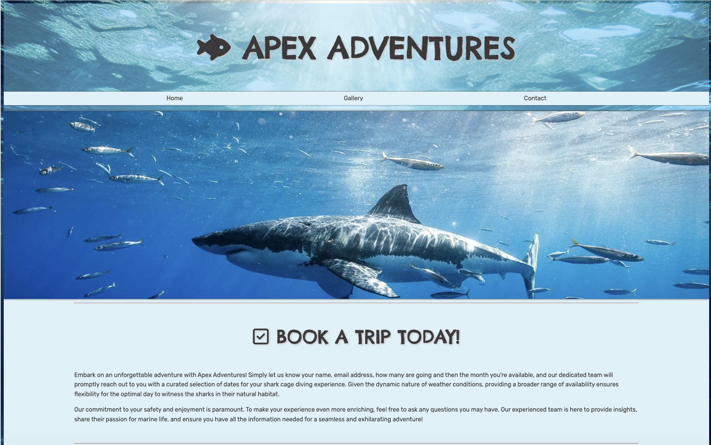

### Booking Page with Map:
The Booking page features a section to easily make a booking request and a map showcasing the location of our HQ, enhancing transparency for customers.  This streamlined process ensures a smooth and hassle-free booking experience, seamlessly integrating the map with the booking form.

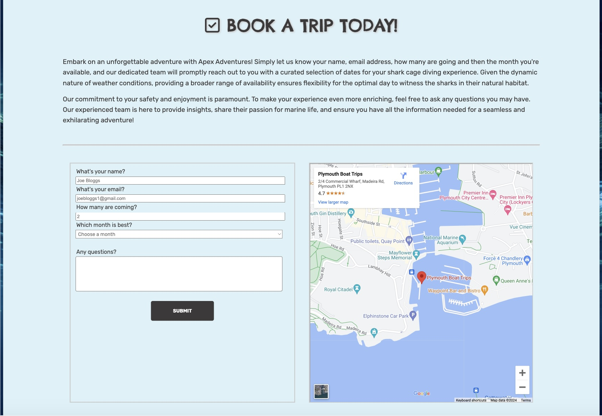

## Features Left to Implement

### Diving Locations Timeline:
A dynamic timeline showcasing the historical development and evolution of great white shark cage diving locations around the world. Historical facts and milestones related to each location, offering users an immersive journey through time.

### Safety Measures:
A section highlighting the historical evolution of safety measures and protocols in great white shark cage diving. Information on advancements in technology and practices to ensure the well-being of both divers and sharks.

## Technologies Used

### HTML 5 and CSS:
HTML5 (HyperText Markup Language) and CSS (Cascading Style Sheets) are the fundamental web development languages used to structure and style the web content, ensuring a visually appealing and well-organized website.

### Google Fonts:
Google Fonts is a library of free and customisable fonts that enhances the visual aesthetics of a website, allowing for a diverse selection of typography options to suit the project's design- this was used for the logo and h2 elements.

### Google Images:
Google Images served as a valuable resource for obtaining high-quality and relevant images, contributing to the visual appeal and storytelling aspects of the Apex Adventures website. All images from the webiste were taken from Google Images.

### Font Awesome:
 Font Awesome provides a comprehensive collection of scalable vector icons, enhancing the user interface with visually appealing and easily customisable icons for a polished look. The icons that are seen before the h2 elements and in the footer are from Font Awesome.

### Balsamiq Wireframes:
Balsamiq Wireframes is a prototyping tool that facilitates the creation of mockups and wireframes, allowing for the visualisation and testing of website layouts before full-scale development, contributing to efficient and effective design planning. The wireframes that are seen in the [Structure](#structure) section were made in Balsamiq Wireframes.

### Gitpod and Github:
Gitpod, coupled with GitHub, forms a powerful version control and collaboration platform. Gitpod is an online IDE (Integrated Development Environment), while GitHub allows for collaborative coding, version tracking, and project management. These tools promote efficient development workflows, collaboration, and version control, ensuring a robust and well-maintained codebase for the Apex Adventures website.

### Lighthouse
To ensure optimal performance and user experience, I utilized the Lighthouse tool in Google Chrome to conduct a comprehensive performance analysis of the Apex Adventures website. Lighthouse evaluates various aspects, including page speed, accessibility, SEO, and best practices, providing invaluable insights into potential optimizations. The tool not only identifies areas for improvement but also aligns with our commitment to delivering a fast, accessible, and user-friendly website. Leveraging the Lighthouse tool has been integral in refining the performance of the Apex Adventures platform, ensuring it meets high standards and provides an exceptional online experience for users.

## Testing

I've rigorously tested each facet of the Apex Adventures website to ensure a robust and user-friendly platform. The interactive nature of the navigation bar has been thoroughly examined, providing seamless transitions between pages such as Home, Gallery, and Contact. The footer maintains its consistency across all pages, featuring dynamically resizing social media links to prevent stacking on smaller screens, enhancing both aesthetics and functionality.

The clickable main heading/logo ensures an intuitive user experience, offering a convenient way to navigate back to the home page. In terms of responsiveness, I've meticulously examined the site on various screen sizes, implementing media queries to tailor the layout for specific devices. Notably, below 480px, I've ensured that #hero-1 and #main-1 dynamically shrink, preserving a visually balanced image display.

The photo gallery has been designed to be responsive, intelligently stacking images on top of each other on smaller screens, optimizing the viewing experience. Furthermore, the map and booking form seamlessly adapt on smaller screens, with the map shifting below the booking form on phones to enhance visibility. The footer icons have been crafted to appear smaller when the screen size is 280px or below, preventing stacking and maintaining an organized layout.

Extensive cross-browser testing has been conducted to guarantee compatibility across diverse platforms. Apex Adventures has been tested on popular browsers, including Chrome, Firefox, Safari, and Edge, ensuring a consistent and enjoyable experience for users regardless of their chosen browser. This meticulous testing process instills confidence that the website is not only visually appealing but also highly functional, meeting the needs of users across a diverse array of devices and browsers.

The Apex Adventures website has undergone comprehensive testing on various platforms, including desktop environments, iPhone 14, iPhone 12 mini, iPhone XS, Samsung Chrome, Safari, Firefox, and Edge. This diverse range of devices and browsers ensures that users across different platforms have a consistent and reliable experience.

During testing, a minor issue was identified on the Safari browser where the drop-down menu for the date on the form appeared with a grey background and white text. To maintain a cohesive and visually pleasing design across all browsers, I promptly addressed this issue by adding a rule to the select class, ensuring a white background with black text, aligning it with the overall theme of the page. This proactive approach to troubleshooting underscores our commitment to delivering a seamless experience for users, regardless of their chosen browser or device. The implementation of this rule ensures a uniform appearance and functionality across all supported browsers, contributing to the overall success of the Apex Adventures website.

### Validator Testing

I am pleased to report that during the development of the Apex Adventures website, no errors were returned when passing through the official HTML and CSS validators. This meticulous validation process ensures that the code adheres to industry standards and is free of syntax errors, contributing to a well-structured, accessible, and compliant website. The absence of validation errors underscores our commitment to delivering a seamless and error-free user experience, reinforcing the reliability and professionalism of the Apex Adventures platform.

### HTML:
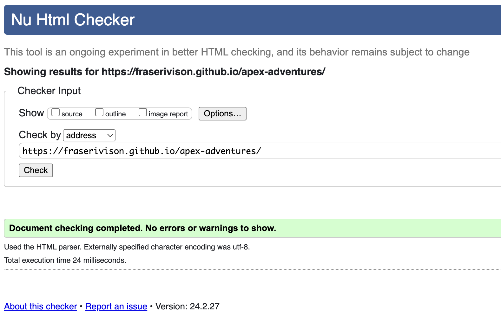

### CSS:
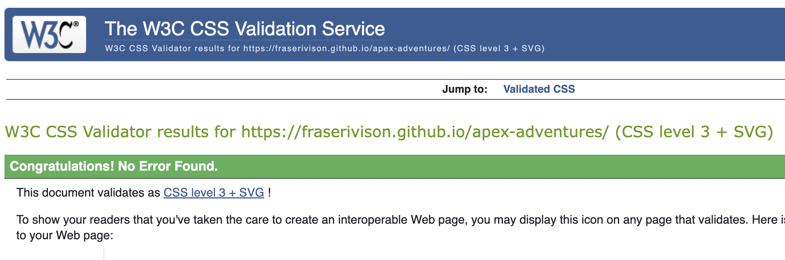

## Performance

To ensure optimal performance and user experience, I utilized the Lighthouse tool in Google Chrome to conduct a comprehensive performance analysis of the Apex Adventures website. Lighthouse evaluates various aspects, including page speed, accessibility, SEO, and best practices, providing invaluable insights into potential optimizations. The tool not only identifies areas for improvement but also aligns with our commitment to delivering a fast, accessible, and user-friendly website. Leveraging the Lighthouse tool has been integral in refining the performance of the Apex Adventures platform, ensuring it meets high standards and provides an exceptional online experience for users.

### Desktop:
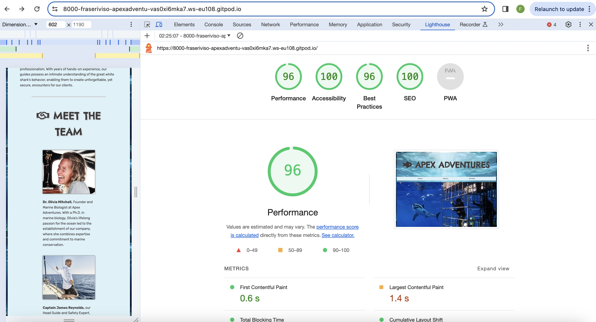

### Mobile:
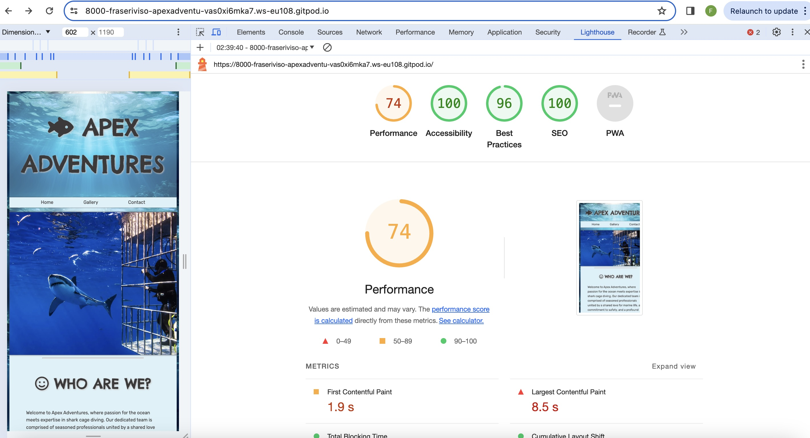
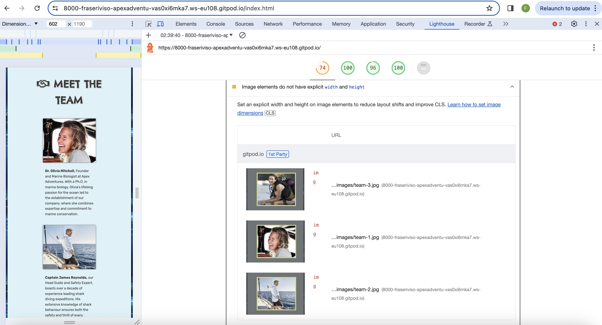

One of the issues the came up was that the images in the Meet The Team section did not have an explicit height and width set. After setting the height and width and adding a media query to make the image repsonsive to a smaller screenize, the score improved:

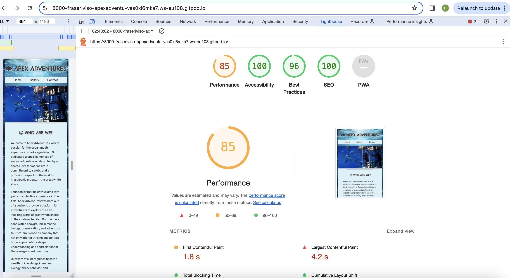

While the Apex Adventures website has performed well in various aspects, there are opportunities for future enhancements to improve overall performance. Issues such as eliminating render-blocking resources, properly sizing images, and serving them in next-gen formats can significantly reduce page load times, contributing to a faster and more efficient user experience. Addressing concerns related to the Largest Contentful Paint element, enabling text compression, and efficiently encoding images will further optimize the website's performance, enhancing its responsiveness and speed. These potential improvements align with our commitment to continuous refinement, ensuring that Apex Adventures remains at the forefront of delivering a seamless and high-quality online experience for users.

## Bugs
Throughout the meticulous testing and construction phases of the Apex Adventures platform, I am pleased to report that no bugs or significant issues were identified. Our rigorous testing process encompassed thorough examinations of each feature, from the interactive navigation bar to the responsiveness of the photo gallery and the seamless adaptation of the map and booking form on different screen sizes.

The absence of bugs underscores the commitment to quality and precision in the development of Apex Adventures. Every element, including clickable features, resizing components, and cross-browser compatibility, was scrutinized to ensure a flawless user experience. This robust testing process not only guarantees the smooth functionality of the website but also instills confidence that users can explore Apex Adventures without encountering any unexpected issues.

The commitment to a bug-free platform aligns with our dedication to providing users with a reliable, enjoyable, and hassle-free experience as they embark on their shark cage diving adventure. We will continue to uphold these high standards to ensure Apex Adventures remains a seamless and trustworthy destination for all users.

## Deployment

The deployment process for the Apex Adventures website on GitHub Pages followed these step-by-step instructions:

1. Access the `GitHub` repository containing the [ApexAdventures](https://github.com/fraserivison/apex-adventures) project.

2. Navigate to `Settings` which is located at the far right of the toolbar and click on it.

3. On the left hand side there is an option called `Pages`.

4. Once that has been clicked on there is a section that says `Branch` with a button underneath that will need to be set to `Main` and `Route`.

5. Once that has been selected, the `GitHub Pages` section will automatically refresh, indicating the ongoing deployment process.

6. Upon successful deployment, a detailed ribbon display will appear, signaling that the Apex Adventures website is now live on GitHub Pages.

7. The live link to the deployed website can be accessed at the GitHub Pages URL, which will be displayed in the GitHub Pages section at the top of the screen. The live link for Apex Adventures can be found [here](https://fraserivison.github.io/apex-adventures/).

This streamlined deployment process ensures that the latest version of the Apex Adventures website is consistently available on GitHub Pages, providing a public-facing link for users to explore.

The site was deployed to GitHub pages. I used Gitpod as the development environment and commmited all the changes in thte terminal. The steps to deploy the site are as follows:

To run the Apex Adventures website locally, follow these additional steps:

1. Log in to `GitHub` and navigate to the Apex Adventures repository.

2. Click on the `Code` button and select `Download ZIP` to download the entire repository as a compressed file.

3. Once the download is complete, extract the `ZIP` file to access the project files.

4. Utilise the extracted files in your preferred local development environment to explore and make modifications as needed.

By following these steps, developers can easily download the Apex Adventures repository, extract the project files, and run the website in their local environment for testing, debugging, or further development. This process facilitates a seamless transition between local development and GitHub Pages deployment, ensuring a smooth and efficient workflow.

## Credits

Favicon: [Favicon](https://favicon.io/emoji-favicons/shark)

Main Fonts: [FontAwesome](https://fontawesome.com/kits)

Responsive Font Size: [MakeUseOf](https://www.makeuseof.com/how-to-create-responsive-typography-with-css/#:~:text=For%20the%20heading%20%E2%80%9Ch1%E2%80%9D%20the,responsive%20to%20different%20screen%20sizes.)

Navigation Bar [CodePen](https://codepen.io/maheshambure21/pen/QwXaRw)

Gallery (gallery.html): [SheCodes](https://www.shecodes.io/athena/10013-how-to-make-image-grids-responsive-with-css#:~:text=To%20create%20a%20responsive%20image,adjusting%20to%20different%20screen%20sizes.) and [W3Schools](https://www.w3schools.com/howto/tryit.asp?filename=tryhow_css_zoom_hover)

Dont Take Our Word For It (gallery.html): [W3Schools](https://www.w3schools.com/css/tryit.asp?filename=trycss3_flexbox_responsive) and [DEV](https://dev.to/dawnind/3-ways-to-display-two-divs-side-by-side-3d8b)

Meet The Team (index.html): [StackOverflow](https://stackoverflow.com/questions/22592064/how-to-align-text-below-an-image-in-css)

Booking Form (contact.html): [Programiz](https://www.programiz.com/css/form-styling) and [MDN](https://developer.mozilla.org/en-US/docs/Web/HTML/Element/option)

Map (contact.html): [HubSpot](https://blog.hubspot.com/website/how-to-embed-google-map-in-html)

Footer: [StackOverFlow](https://stackoverflow.com/questions/39337956/centering-social-media-icons-in-footer-of-website#:~:text=page%2Dfooter%20add%20a%20property,the%20middle%20of%20the%20element.)

README.md Template: [README.md](https://github.com/marcin-kli/MP1/blob/Milestone-Projects/README.md)

404.html Template: [GeeksForGeeks](https://www.geeksforgeeks.org/create-a-404-page-using-html-and-css/)